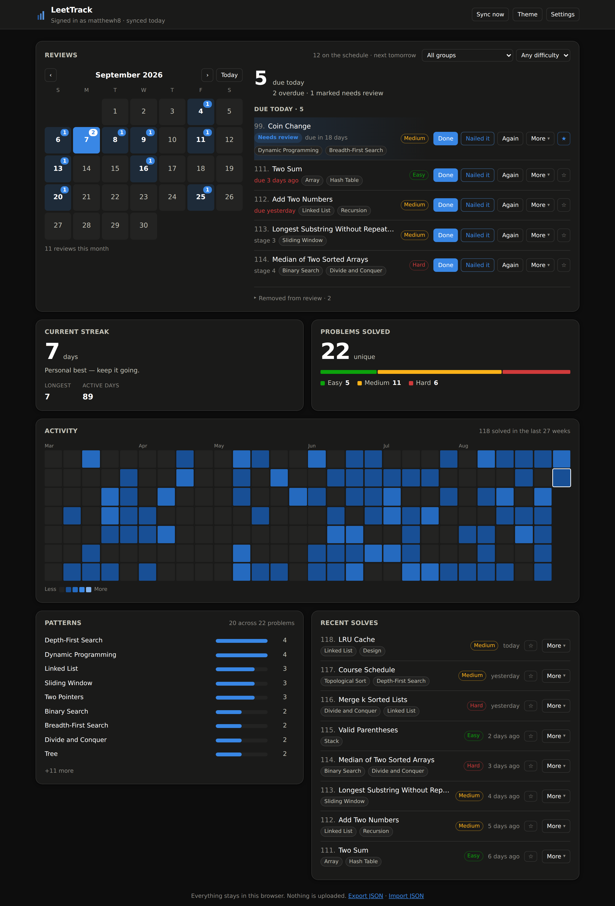

# LeetTrack

A local-only Chrome extension that turns LeetCode practice into something you can
actually see: a **streak**, your **submission quality**, and a **spaced-repetition
review schedule** so solved problems don't quietly evaporate.

Everything lives in `chrome.storage.local`. There is no server, no account, and no
telemetry. The only network requests the extension makes are to LeetCode itself,
using the session you're already signed in with.



## What it does

- **Streak** — current and longest run, active days, and a contribution heatmap.
  A day only breaks the streak once it has fully passed, so an empty evening
  doesn't panic you at 6pm.
- **A day that ends at 2am, not midnight** — solve something at 1am and it
  counts towards the day you were already having. The boundary is configurable
  (`Settings → A new day starts at`), and moving it re-files the history you
  already have.
- **Spaced repetition** — every solved problem is scheduled for review on a
  configurable ladder (default `1, 3, 7, 14, 30, 60, 120, 240, 365` days).
  `Done` graduates it to the next rung and `Again` sends it back to the start.
  When you can't face it today: `Delay` pushes it by a day, a week, or any
  number of days you type, and `Skip this cycle` pushes it a whole interval at
  the current stage — neither counts as a review, so the ladder doesn't move.
- **Nailed it** — the one you barely had to think about. It skips a whole
  cycle: the problem jumps two rungs instead of one, but the next review is
  still only one rung away. From the 3-day rung, `Done` makes it a 7-day
  problem due in a week; `Nailed it` makes it a *14-day* problem, also due in
  a week. Confidence should move the ladder, not blank the problem out for a
  month on one good day.
- **Groups** — filter the whole review card (calendar, count, and queue) by
  topic and difficulty, for when you want a linked-list session rather than
  whatever the schedule coughed up. Clicking a row in `Patterns` filters by it.
  Matching is on the problem's whole tag list, not just the chips it shows, so
  filtering by `Linked List` finds the one whose chips say `Recursion`.
- **Needs review** — a star on any problem, in the queue or in recent solves,
  that pulls it to the top of the queue whatever its due date says. For the ones
  you technically solved but couldn't explain a week later.
- **Remove from review** — take a problem off the schedule for good. It
  disappears from the queue and the calendar but stays in your solved count,
  your heatmap, and your patterns: it was still practised, it just doesn't need
  asking about again. Listed under `Removed from review` with a one-click
  restore, so removed never means deleted.
- **Patterns** — which techniques you've actually practised, ranked. LeetCode
  tags every problem, but its tags mix the *technique* that solves it (Sliding
  Window, Monotonic Stack) with the *container* it happens to use (Array, String,
  Hash Table). Raw, the generic ones drown out the useful ones — "Two Sum: Array,
  Hash Table" says nothing about what you practised. So tags are ranked by how
  much they say about approach and the best one or two are surfaced. Data
  structures rank *with* the techniques, not below them: a linked-list problem
  is a linked-list problem, and burying that under "Recursion" — true of half of
  LeetCode — loses the one word you would have searched for.
- **Tags you can correct** — LeetCode's tags aren't gospel, and a wrong one
  skews the patterns breakdown and the group filter for as long as it sits
  there. Every row's `More` menu lists the problem's tags with an × on each.
  Removal is an overlay, never a delete: the removed ones are listed underneath
  with one-click restore, and neither the next sync nor solving the problem
  again brings them back on their own.
- **Problem numbers** — the LeetCode number in front of every title, the way
  people actually refer to these ("143", not "that reorder one"). Numbers come
  from GraphQL, so anything captured live shows without one until the next sync
  fills it in.
- **Popup** — the streak and today's review queue, with one-tap Done and a
  one-tap push to tomorrow.
- **Track from** — a start date for your history. Solves before it are ignored,
  and setting one deletes what came before, so you can wipe test data or start a
  fresh season without uninstalling.

## Install (unpacked)

```bash
git clone https://github.com/matthewh8/LeetTrack.git
```

1. Open `chrome://extensions`
2. Enable **Developer mode**
3. **Load unpacked** → select the cloned folder
4. Open leetcode.com while signed in, then click the LeetTrack icon

Requires Chrome 111+ (the capture path uses `"world": "MAIN"` content scripts).

## How capture works

Two independent paths, so neither one failing loses your history:

**Live interception.** `src/content/interceptor.js` runs in the *page's* JS
context and wraps `fetch`/`XHR` to observe LeetCode's own
`/submissions/detail/{id}/check/` polling. That's the only way to see verdicts —
an isolated content script can't observe the page's fetches, and MV3 removed
response-body access from `webRequest`. It observes only: it never alters
arguments, always clones the response, and swallows its own errors so a change
on LeetCode's side cannot break the page. `src/content/bridge.js` validates the
message and relays it to the service worker.

**GraphQL reconciliation.** The service worker periodically queries
`recentAcSubmissionList` to backfill solves made while no instrumented tab was
open, and `question(titleSlug:)` to fill in difficulty and topic tags. If the
submit endpoint ever changes shape, live capture degrades but solve history and
streaks stay correct.

## Layout

```
manifest.json
src/lib/        time, streak, scheduler, stats, prune, rekey
                                        (pure — no chrome.*, tested)
                storage, leetcode-api   (the only chrome.* / network layers)
src/content/    interceptor (MAIN world), bridge (isolated)
src/bg/         service worker — messaging, sync alarm, reminders
src/ui/         dashboard + popup, components/
test/           unit tests, static checks, render harness
```

No build step and no runtime dependencies — plain ES modules, loaded directly.
Playwright is a dev dependency used only by the render harness.

## Development

```bash
npm test        # 109 unit tests: day boundaries and windows, streaks, scheduling,
                #   retiring, tag edits, stats, pruning, and the day-window migration
npm run check   # manifest refs resolve; lib/ stays free of chrome.*
npm run render  # screenshots the dashboard light/dark/narrow into shots/
```

`npm run render` seeds a fake `chrome.storage` with fixture data and drives a
headless Chromium, so the UI can be checked without loading the extension. It
also fails on page errors and horizontal overflow.

## Verification status

Unit tests, static checks, and the render harness all pass. **The two capture
paths are not yet verified against live LeetCode** — that needs a signed-in
session, which the development container doesn't have. Load the extension
unpacked and submit one problem to confirm end-to-end.

## Layout

Reviews are the only thing on the dashboard you *act* on, so they get the whole
top of the page: the month calendar on the left, today's queue on the right of
it. Everything else — streak, solved counts, heatmap, patterns, recent solves —
is a read-out and sits below. A long overdue pile is capped at ten rows behind a
`Show all` so it can't push the rest of the page out of reach.

Removing a problem from review marks the row `retired` rather than deleting it.
`recordSubmission` only schedules a problem it has never seen, so a deleted
review would quietly come back the next time you solved that problem — the
tombstone is what makes "remove" stick. Everything that reads the schedule
(`dueBy`, the calendar counts, the reminder) filters retired rows out; nothing
that counts practice does.

## The day window

Day keys are baked into rows when they're recorded — `attempt.day`, and the
whole per-day rollup the streak and heatmap read. So moving the boundary can't
just change how new solves are filed; the history already on disk would keep
describing the old one, and a 1am solve from last week would still be sitting on
the wrong day.

`src/lib/rekey.js` re-derives both from the one thing that never changes, the
attempt's epoch timestamp, and rebuilds the rollup from the attempts that
survive. `syncDayWindow` stamps the applied window in `meta`, so the work
happens once — on upgrade, on a settings change, or after a timezone change,
which had the same staleness problem and was never re-applied before. Days
older than the oldest surviving attempt are left alone: attempts are capped at
5000, and there is no evidence left to re-file them with.

## Starting over

`Settings → Track from` sets the first day that counts. Saving a date does two
things: it deletes every attempt, day, problem, and review before it, and it
stores the date as a cutoff so `recordSubmission` drops anything older. The
second half is what makes it stick — the GraphQL backfill re-reports your last
20 accepted solves on every sync, so a delete without a cutoff would undo itself
within half an hour. Problems solved both before and after the date survive with
their counts re-derived from the solves that were kept. Export first if you want
the old history back; there is no undo.

## How long the ladder runs

The default rungs are `1, 3, 7, 14, 30, 60, 120, 240, 365` days — roughly a
doubling each time, which is where the expanding-interval work keeps landing:
the gap that pays is a sizeable fraction of how long you want to hold the
material, so each successful recall buys a much longer wait than the last.

Past a year, the honest answer is that the evidence thins out. The multi-year
retention studies are few, small, and about vocabulary and facts rather than
whether you can still write the algorithm; there is no measured rung to put
after 365 that would be more than a guess. So the ladder stops there and
repeats its last rung forever — a mature problem keeps coming back annually
rather than falling off the schedule. If you want longer, the intervals are a
comma-separated list in Settings; the ladder is whatever you type.

## Design notes

Colors are assigned by job rather than taste. The heatmap is a single-hue
sequential blue ramp; difficulty uses the reserved status palette. Green and red
sit only ~4 ΔE apart under deuteranopia, so **hue never carries meaning alone** —
difficulty counts are always spelled out beside the bar.

Pattern chips are deliberately neutral. There are far more patterns than a
categorical palette can hold without cycling hues, so the tag name carries the
identity and color stays out of it.

## Privacy

- No remote server, no analytics, no account.
- Requests go only to `leetcode.com` / `leetcode.cn`, authenticated by the cookie
  your browser already sends. The extension never reads or stores that cookie.
- `Export JSON` writes a file locally; `Import JSON` reads one back.

## License

MIT
